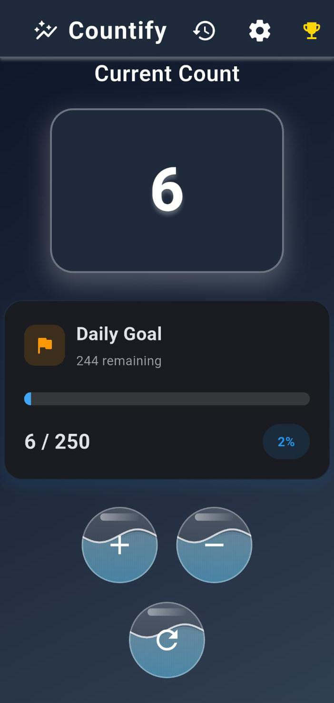
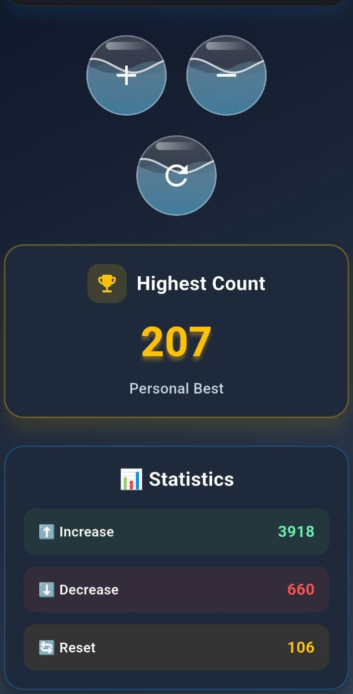
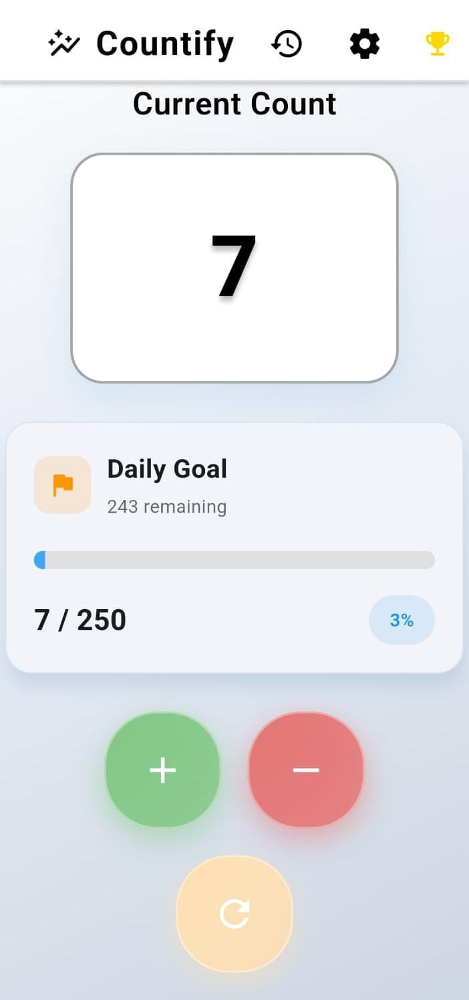
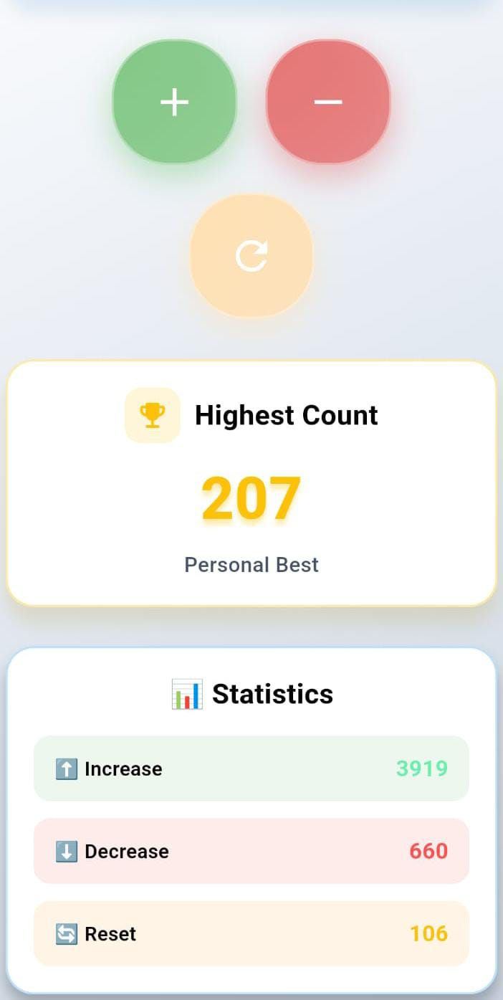
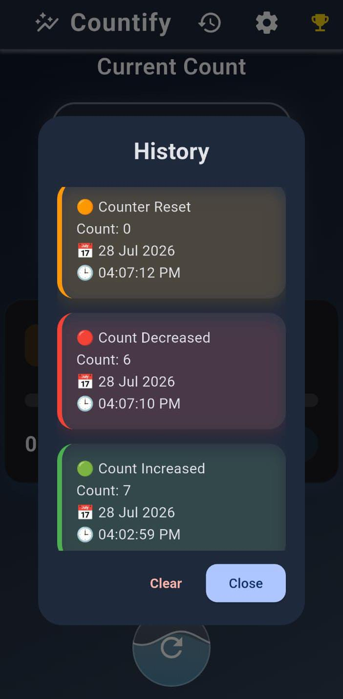
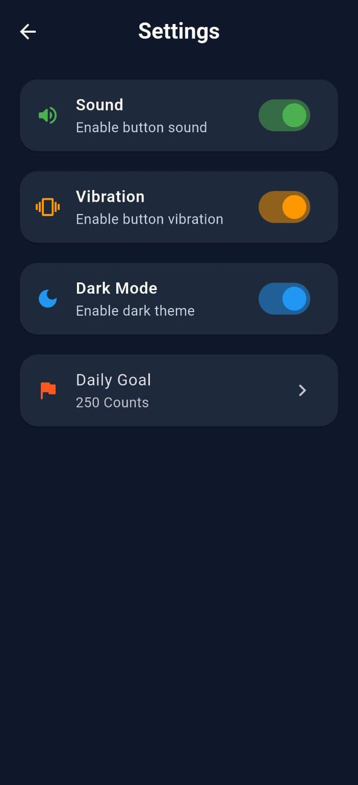
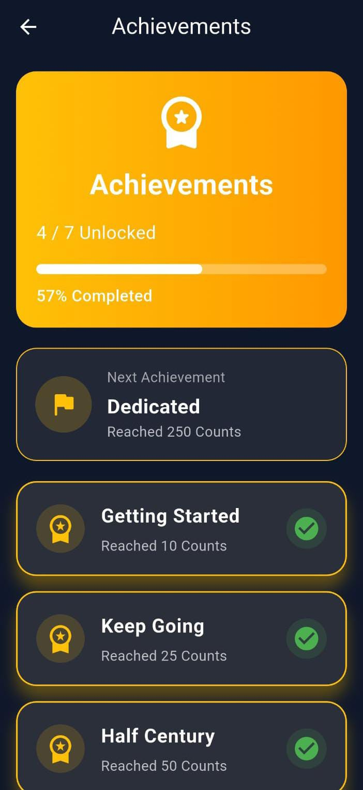
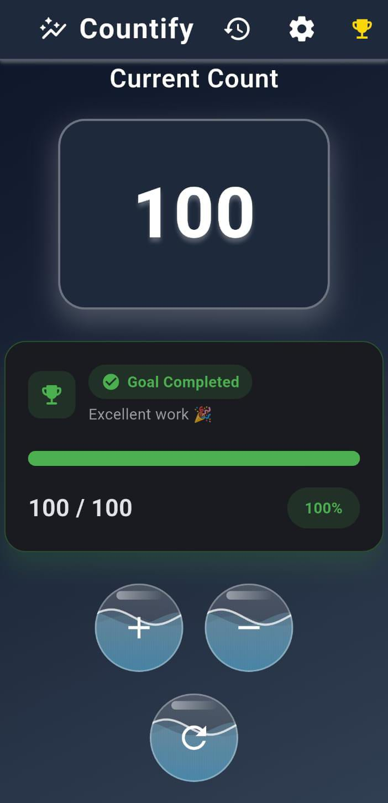

# 📱 Countify

> A modern Flutter counter app built with Flutter, featuring a premium UI, daily goals, achievements, statistics, history tracking, sound effects, vibration feedback, and persistent local storage.


---

## ✨ Features

- 🎨 Beautiful Light & Dark Theme
- ➕ Increase & Decrease Counter
- 🔄 Reset Counter
- 💾 Auto Save with SharedPreferences
- 🏆 Achievement System
- 🎯 Daily Goal Progress Tracker
- 📊 Detailed Statistics
- 🕒 History with Date & Time
- 🔊 Sound Feedback
- 📳 Vibration Feedback
- 🌊 Animated Liquid Buttons
- ⚡ Smooth UI Animations
- 📱 Responsive Design

---

# 📸 Screenshots

### 🌙 Dark Theme

| Home                                   | Home (Scroll)                                 |
|----------------------------------------|-----------------------------------------------|
|  |  |

---

### ☀️ Light Theme

| Home                                    | Home (Scroll)                                  |
|-----------------------------------------|------------------------------------------------|
|  |  |

---

### 📊 Features

| History                              | Settings                              |
|--------------------------------------|---------------------------------------|
|  |  |

| Achievements                              | Goal Completed                              |
|-------------------------------------------|---------------------------------------------|
|  |  |

---

## 🛠 Tech Stack

- Flutter
- Dart
- Material Design 3
- SharedPreferences
- Soundpool
- Vibration
- Flutter Animate

---

# 📂 Project Structure

```text
lib/
├── controllers/
├── dialogs/
├── models/
├── screens/
├── services/
├── theme/
├── widgets/
└── main.dart
```

---

# 🚀 Getting Started

### 1. Clone the repository

```bash
git clone https://github.com/CodingWithHabib/Countify.git
```

### 2. Navigate to the project

```bash
cd Countify
```

### 3. Install dependencies

```bash
flutter pub get
```

### 4. Run the app

```bash
flutter run
```

---

# 📦 Packages Used

| Package | Purpose |
|----------|---------|
| shared_preferences | Local data storage |
| soundpool | Button click sound |
| vibration | Haptic feedback |
| flutter | UI framework |

---

# 🎯 Current Features

- ✅ Premium UI
- ✅ Light & Dark Theme
- ✅ Animated Counter
- ✅ Daily Goal
- ✅ Statistics
- ✅ Achievement System
- ✅ History Tracking
- ✅ Persistent Storage
- ✅ Sound Feedback
- ✅ Vibration Feedback
- ✅ Responsive Layout

---

# 🚀 Planned Features

- 🔔 Daily Reminder Notifications
- ☁️ Cloud Backup
- 📈 Advanced Analytics
- 🎨 More Themes
- 🌍 Multi-language Support
- 📤 Export History
- 🏅 More Achievement Levels

---

# 👨‍💻 Developer

**Habib Ullah**

- 🎓 BS Artificial Intelligence Student
- 💙 Flutter Developer
- 📍 Pakistan

GitHub:
https://github.com/CodingWithHabib

---

# ⭐ Support

If you like this project, consider giving it a ⭐ on GitHub.

It helps the project reach more developers and motivates future improvements.

---

## 📄 License

This project is licensed under the MIT License.